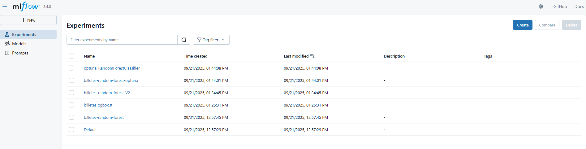
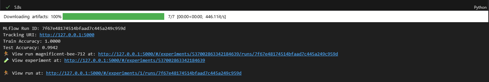
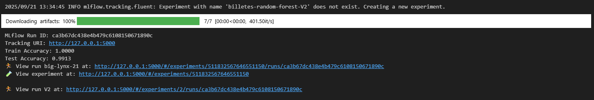
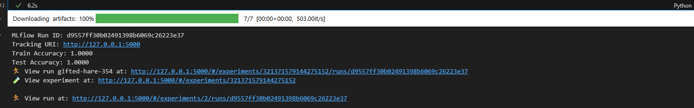
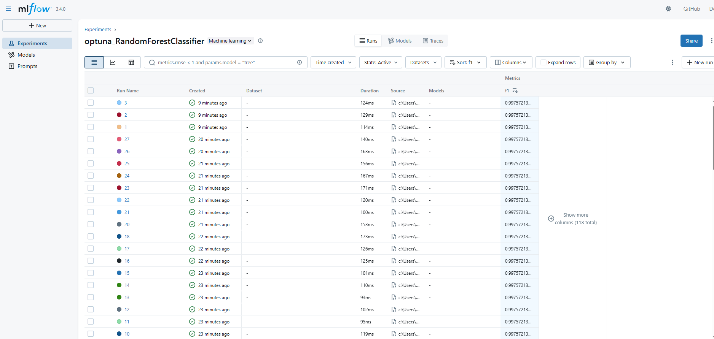
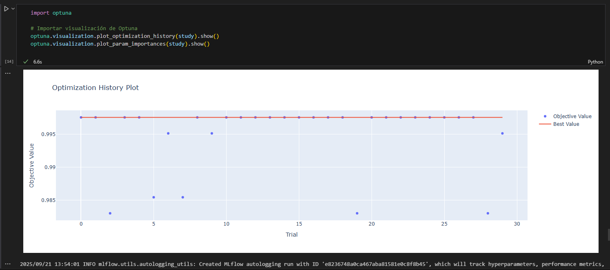
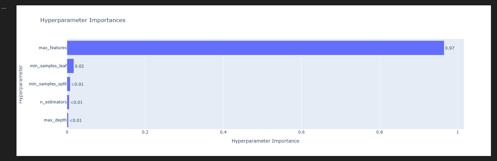
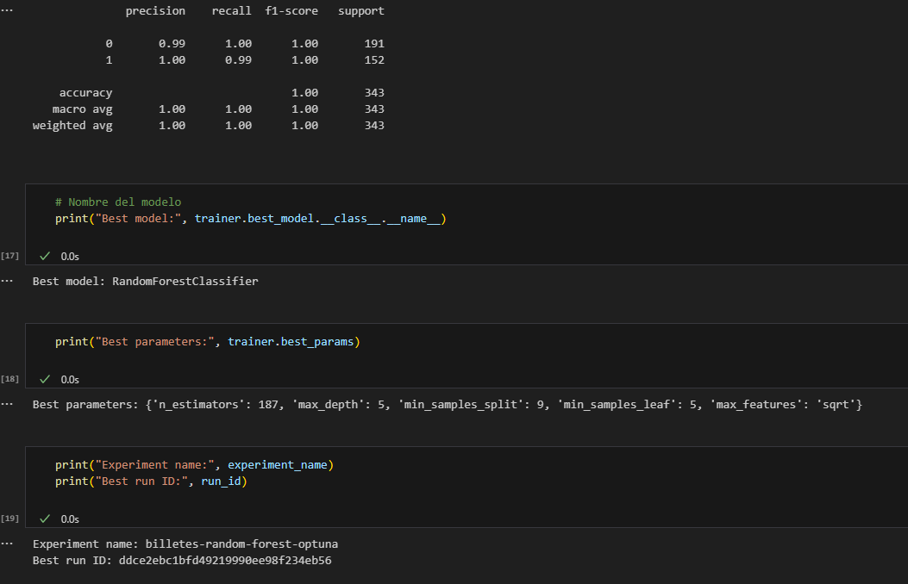

# Proyecto_final_mlops
1) Descripción corta

Construimos un modelo para detectar billetes falsos usando el dataset Banknote Authentication de UCI. El dataset ya viene en formato tabular (no hay imágenes): cada fila representa un billete y sus columnas son estadísticos calculados sobre la textura del billete (a partir de una transformada wavelet).

2) Problema y objetivo de negocio

Dolor del negocio: las entidades pueden sufrir pérdidas por aceptar billetes falsos en caja o cajeros.
Objetivo: reducir el riesgo operativo y las pérdidas mediante un clasificador que ayude a identificar billetes falsos.

3) Dataset y fuente

Nombre: Banknote Authentication

Fuente (UCI): https://archive.ics.uci.edu/ml/datasets/banknote+authentication

Descarga directa (CSV):
https://archive.ics.uci.edu/ml/machine-learning-databases/00267/data_banknote_authentication.txt

Tamaño aproximado: 1.372 filas × 5 columnas

4) Significado de columnas

| Columna      | ¿Qué mide? (intuitivo)                         | Pista típica para fraude                                          |
| ------------ | ---------------------------------------------- | ----------------------------------------------------------------- |
| **variance** | **Contraste/variación** de la textura          | Auténticos suelen tener **> 0**; falsos, **< 0**                  |
| **skewness** | **Inclinación** de la distribución (cola)      | Auténticos: **positiva** (cola derecha); falsos: **0 o negativa** |
| **curtosis** | **Pico** y **colas largas** (valores extremos) | **Alta** aparece más en **falsos**                                |
| **entropy**  | **Desorden/variedad** de la textura            | Muy parecida en ambos; **no separa sola**                         |
| **class**    | Etiqueta objetivo                              | **0 = auténtico**, **1 = falso**                                  |

variance:mide cuánta dispersión tienen los coeficientes, valores altos → mucha variación/contraste en la textura; valores bajos → textura más uniforme.

skewness:mide si la distribución es simétrica o si tiene cola más larga a un lado, mucha asimetría = presencia de coeficientes atípicos (bordes/texturas raras).

curtosis:mide cuán “picuda” es la distribución y qué tan pesadas son sus colas, curtosis alta sugiere patrones muy marcados en la textura (posible señal de falsificación).

entropy: mide complejidad de los coeficientes,más cerca de 0 = mayor entropía.

5) Métricas de Éxito

Exactitud (Accuracy): el modelo debe alcanzar al menos 90%.

Recall en clase “falso”: prioridad que el modelo detecte más del 95% de billetes falsos, para minimizar riesgos de aceptar uno.

Alcance del Proyecto

MVP: construir un modelo de clasificación en Jupyter Notebook, validado con métricas básicas.

Futuro: integrar en un pipeline MLOps con orquestación, despliegue y monitoreo.

6) Timeline y Responsables

| Fase | Actividad                                        | Responsable       | Tiempo estimado |
| ---- | ------------------------------------------------ | ----------------- | --------------- |
| 1    | Revisión del dataset y EDA                       | Carolina Restrepo | 1 semana        |
| 2    | Preprocesamiento y entrenamiento de modelos base | Carolina Restrepo | 1 semana        |
| 3    | Evaluación, documentación y presentación         | Carolina Restrepo | 4 días          |

7) Estrategia de Preprocesamiento

Verificación y eliminación de nulos (no aplicó en este dataset).

Normalización de variables numéricas para modelos sensibles a escala.

Separación en conjuntos train/test (80/20).

Evaluar balance de clases (dataset está equilibrado ≈55% auténticos / 45% falsos).

8) Baseline de Rendimiento

Modelo baseline: Regresión Logística simple.

Métricas esperadas: Accuracy ~90% y Recall clase “falso” >95%.

9) Resultados del EDA

Tamaño y calidad de datos

Filas: 1.372 · Columnas: 5

Nulos: 0 (no se requieren imputaciones)

|     Clase | Significado |    Conteo |         % |
| --------: | ----------- | --------: | --------: |
|         0 | Auténtico   |   **762** | **55.5%** |
|         1 | Falso       |   **610** | **44.5%** |
| **Total** | —           | **1.372** |  **100%** |

variance:Los billetes auténticos suelen tener variance positiva (mayores a 0) y Los billetes falsos suelen tener variance negativa (menores a 0).

skewness:Los billetes auténticos suelen tener asimetría hacia la derecha,los falsos suelen tener asimetría neutra o hacia la izquierda  

curtosis:Los billetes falsos presentan más casos con curtosis muy alta —es decir, picos muy marcados y valores extremos en la textura—, mientras que los auténticos rara vez alcanzan esos extremos. 

entropía: tienen cajas muy parecidas, no se distingue bien entre auténticos y falsos: los dos grupos se comportan casi igual.

10) conclusión: 

variance > 0 y skewness > 0 → más probable Auténtico.
variance < 0 y/o curtosis alta → más probable Falso.

# RESUMEN ENTREGA PARTE 2

Este proyecto implementa un pipeline completo de Machine Learning con enfoque en MLOps, cuyo objetivo es entrenar y optimizar un modelo que clasifique billetes entre verdaderos y falsos.

El flujo completo incluye:

ETL – Extracción y limpieza de los datos desde la fuente original.

Feature Engineering – Creación de nuevas variables que enriquecen el dataset.

Entrenamiento con MLflow – Entrenamiento, tracking de experimentos y logging automático de modelos.

Optimización con Optuna – Búsqueda de hiperparámetros para encontrar el mejor modelo.

Comparación de modelos y métricas – Evaluación en un conjunto de prueba.

🛠️ ETL

El módulo etl.py se encarga de:

Descargar los datos desde el repositorio UCI (data_banknote_authentication).

Convertirlos en un DataFrame de Pandas.

Asignar nombres a las columnas.

✅ Resultado: un dataset limpio y estructurado listo para el entrenamiento.

🧪 Feature Engineering

El módulo feature_engineer.py aplica transformaciones sobre el dataset original:

Nuevas variables creadas:

var_entropy_ratio

magnitude

abs_skewness

curtosis_minus_skewness

bucket_curtosis (feature categórica creada a partir de discretización).

✅ Resultado: un dataset enriquecido que mejora la capacidad predictiva del modelo.

⚙️ MLflow – Tracking de Experimentos

Se utilizó MLflow para:

Registrar parámetros de los modelos.

Guardar métricas de entrenamiento y prueba (accuracy, F1-score, etc).

Almacenar los modelos entrenados para su reutilización.

📸 Pantallazos importantes:

1) Servidor de MLflow mostrando los experimentos creados.
📸 

2) Resultados de RandomForest (baseline y V2) con Train y Test Accuracy.

📸 
📸 

3)Resultados de xgboost
📸 

4) Resultados de RandomForest + Optuna mostrando el mejor run.
📸 
Nota: En la imagen se observa el listado de runs generados por Optuna en MLflow. Cada run corresponde a un conjunto distinto de hiperparámetros probados para el modelo RandomForestClassifier.
El mejor run se identifica en la parte superior de la tabla (mayor valor de f1).

🔍 Optimización con Optuna

Se implementó la clase TrainMlflowOptuna para optimizar hiperparámetros.

Se definió un espacio de búsqueda para n_estimators, max_depth, min_samples_split, min_samples_leaf y max_features.

Se ejecutaron 30 trials registrando todo en MLflow.

📊 Visualizaciones de Optuna:

Se incluyeron visualizaciones para analizar el proceso de optimización:

Optimization History Plot: muestra cómo fue mejorando la métrica F1 a lo largo de los trials.

📸 gráfico de plot_optimization_history: 

Hyperparameter Importances: muestra qué hiperparámetros tuvieron mayor impacto en el resultado.
📸 gráfico de plot_param_importances: 

Importancia de hiperparámetros.

🏆 Resultados Finales

El mejor modelo encontrado fue:

Modelo: RandomForestClassifier

Hiperparámetros:

{'n_estimators': 187, 'max_depth': 5, 'min_samples_split': 9, 'min_samples_leaf': 5, 'max_features': 'sqrt'}

Métricas en test:

Accuracy: 1.00

Precision: 0.99 – 1.00

Recall: 0.99 – 1.00

F1-score: 1.00

📸 